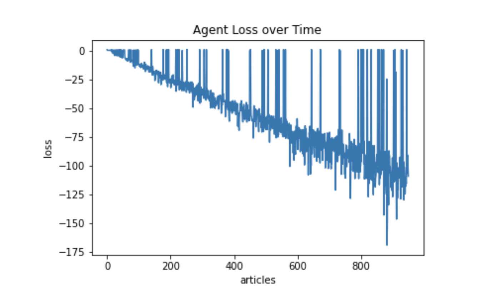
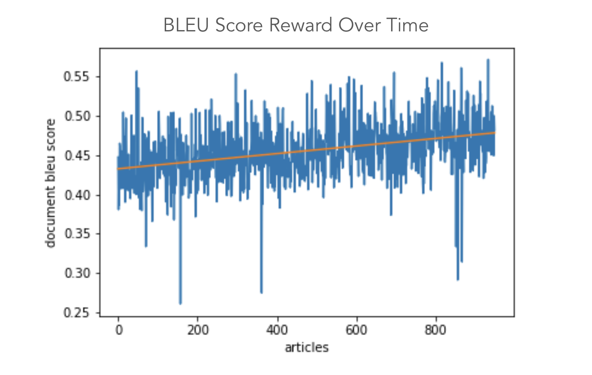

# Online Extractive Text Summarization Using Deep Reinforcement Learning
*By Gauri Narayan and Raefah Wahid*

## Project Description

The task of text summarization is often difficult to automate because of sparse language data and the ambiguous definition of what precisely constitutes a “summary.” For the former issue, deep learning was originally combined with reinforcement learning in order better extract and use multi-dimensional features, like language data. For the latter issue, the reward systems and metrics that are so integral to deep reinforcement learning provide a unique opportunity for a model to learn its own definition of a “summary.” Essentially, deep reinforcement learning can be used to improve upon traditional text summarization techniques, which are often computationally heavy due to their semantic and algorithmic natures. Using a purely extractive online text summarization approach and the BLEU metric as a reward system, we can create an agent to produce summaries from news articles.

## Repository Description

Our work was mostly implemented and compiled in Jupyter Notebooks. Here is a description of each of the files and directories in this repository.
- text_vectorization.ipynb
- DQN-modified.ipynb
- data: A directory that contains raw text of the news articles as well as Pickle files with the embeddings of the articles. You can view [the directory here](https://drive.google.com/drive/folders/1_8RYwoHSEWnujQqj0FLA3AcB58uB_u2P?usp=sharing), as its contents are too large for the GitHub file size limits.
  - articles1.csv: raw text of news articles
  - batch1…batch20: Pickle files of the document and sentence embeddings

## Commands

In order to run our project, we compiled a demo notebook that uses our saved model to produce text summarizations.

// instructions 

## Results

The loss does decrease steadily over the course of the model’s training. The BLEU metric fluctuates quite a bit and shows an overall gradual upward trend, but it is not by much. On the whole, this makes sense since we shouldn’t expect any vast improvement in readability (which the BLEU metric primarily speaks to) as we are pulling sentences from text that is already human-verified to be readable. Despite our initial thoughts, the BLEU metric did not encourage brevity and the reward system that incorporated it tended to produce summaries that only knocked one or two sentences off the original article. This speaks back to an issue of finding an appropriate reward system for something as subjective as natural language. For future steps, it might be worthwhile to borrow techniques from information theory to more adequately measure and score the information conveyed by a summary, alongside the BLEU metric.
